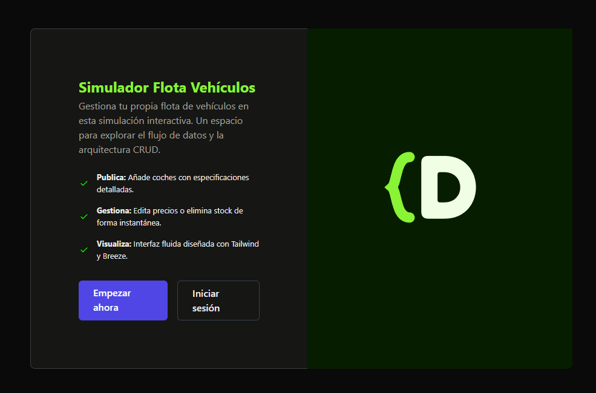
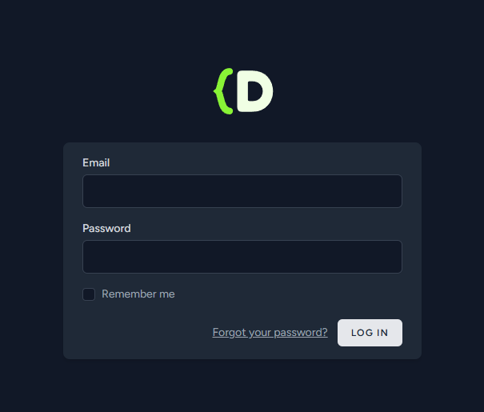
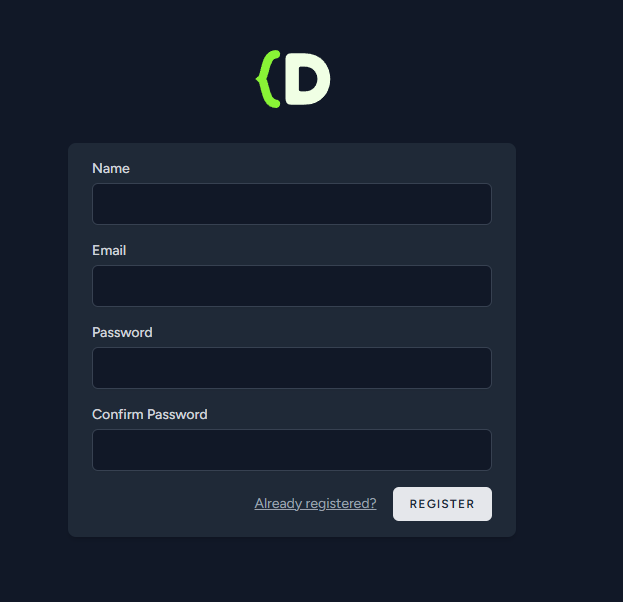
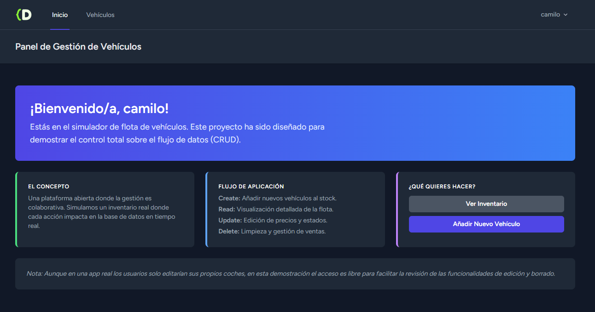
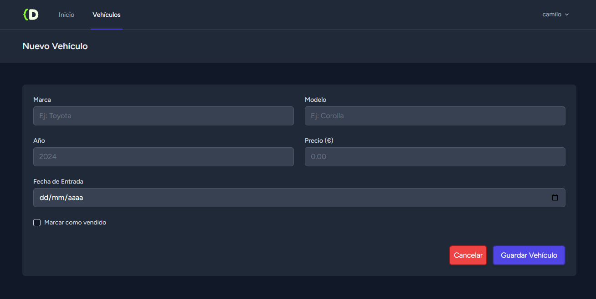
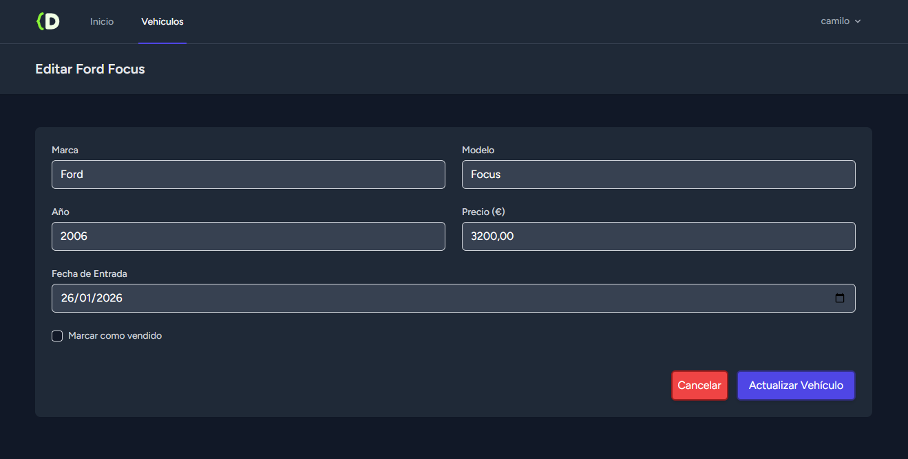

# Fleet Simulator - Laravel & Breeze

**Fleet Simulator** es una plataforma de gestión de flotas diseñada para administrar vehículos de manera eficiente. Construida sobre el ecosistema de **Laravel**, integra un sistema de autenticación seguro y un control total (CRUD) sobre la entidad de coches.

---

## Funcionalidades

### Gestión de Acceso
* **Registro de Usuarios:** Sistema de alta para nuevos administradores.
* **Autenticación (Login/Logout):** Acceso protegido mediante Laravel Breeze.
* **Seguridad:** Rutas protegidas que requieren validación de sesión.

### Panel de Gestión de Flota (CRUD)
* **Visualización:** Listado detallado de todos los coches en el sistema.
* **Creación:** Registro de nuevos vehículos con especificaciones técnicas.
* **Edición:** Actualización de información en tiempo real.
* **Eliminación:** Retirada de vehículos de la base de datos.

---

## Flujo de la Aplicación

A continuación se detallan las capturas del flujo principal:  

### 1. Inicio de la Aplcación
| Inicio |
|:---:|
|  |

### 2. Autenticación
| Inicio de Sesión | Registro de Usuario |
|:---:|:---:|
|  |  |

### 3. Principio de app
| Principio de app
|:---:|
|  |

### 4. Gestión de Flota
| Listado General | Registro de Vehículo |
|:---:|:---:|
|  |  |

### 5. Edición y Control
| Edición de Datos 
|:---:|
|  |

---

## Instalación y Configuración

Sigue estos pasos para desplegar **Fleet Simulator** localmente:

### 1. Preparación del Proyecto
Clona el repositorio y accede a la carpeta:
```bash
git clone [https://github.com/camiliillo18/CRUD-Breeze.git](https://github.com/camiliillo18/CRUD-Breeze.git)
cd CRUD-Breeze
```

### 2. Instalar dependencias
Instala los paquetes de PHP (Composer) y de JavaScript (NPM):
```bash
composer install
npm install
```

### 3. Configurar variables de entorno
Copia el archivo de ejemplo y genera la clave de la aplicación:
```bash
cp .env.example .env
php artisan key:generate
```

### 4. Migrar la base de datos
Crea las tablas necesarias (incluyendo la de usuarios y coches):
```bash
php artisan migrate
```

## Ejecución
Compilar assets (Tailwind/Vite):
```bash
npm run dev
```

Iniciar el servidor local:
```bash
php artisan serve
```

## Tecnologías Utilizadas
* Laravel (Framework PHP)
* Laravel Breeze (Autenticación minimalista)
* Tailwind CSS (Estilos)
* Vite (Build tool)
* MySQL (Base de datos)